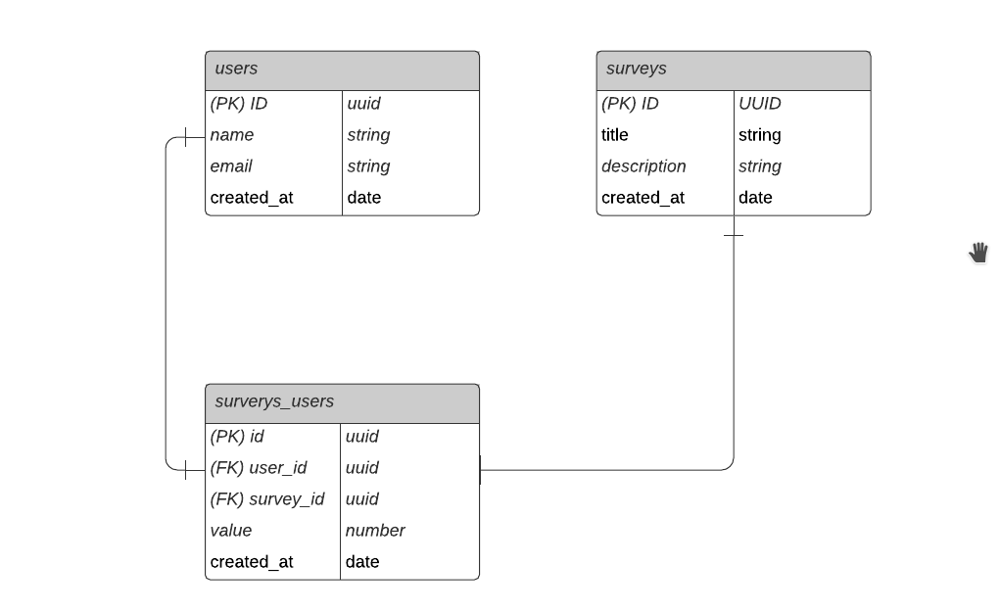

<h1 align="center">NPS-NLW</h1>

  

## Project

NPS-NLW is an application that consists of calculating the company's NPS. In it we make the registration of users, registration of surveys, sending e-mail for users to answer the satisfaction surveys and with this we can perform the calculation of the NPS.

This project was developed during the NodeJS trail, in the fourth edition of NLW. We learned concepts about what an API is, how to start a project using Typescript and Express for route management, TypeORM for data manipulation, automated tests and sending e-mail.

## Technologies

This project was developed with the following technologies:

- [TypeScript](https://www.typescriptlang.org/)
- [Ethereal-Email](https://ethereal.email/)
- [TypeORM](https://typeorm.io/#/)
- [Express](https://expressjs.com/pt-br/)
- [Jest](https://jestjs.io/)
- [SQL Editor Beekeeper Studio](https://www.beekeeperstudio.io/)

## Database diagram

## How to run

- Clone the repository
- Install dependencies with `yarn`
- Start the server with `yarn dev`

The application can be accessed at [`localhost:3333`](http://localhost:3333).

Note: If you are going to run locally, disable the antivirus to avoid SSL error.

## License

This project is under the MIT license. See the [LICENSE](LICENSE.md) file for more details.